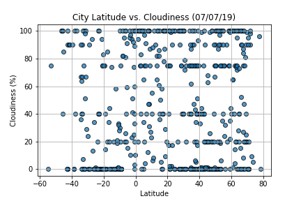

# Weather Factors vs. Location

Current weather data from randomly selected cities are called via OpenWeatherMap API. Four scatter plots were created to show relationship among latitude and other various weather information such as maximum temperature, humidity, cloudiness, and wind speed. Because Canada uses metric system, all information shown in codes and plots are also in metric units: degrees Celsius for temperature and metre per second for wind speed.

The main observations for the analysis are as follows:

1. Cities in the northern hemisphere are warmer than those in the southern hemisphere as it is summer in the northern hemisphere. Especially, cities of which latitude coordinate is in between 20 deg and 40 deg are currently the warmest around the globe.
2. Generally, temperature becomes higher as the latitude reaches the equater.
3. There does not exist a clear correlation between latitude and humidity.
4. A correlation between latitude and cloudiness is also lacking.
5. Lastly, wind speed does not seem to be related to latitude

Refer to `WeatherPy_SooBin.ipynb` for codes.

Images below are the scatter plots created:

